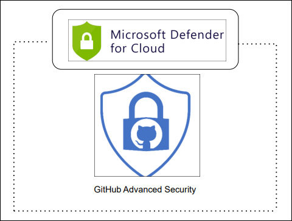
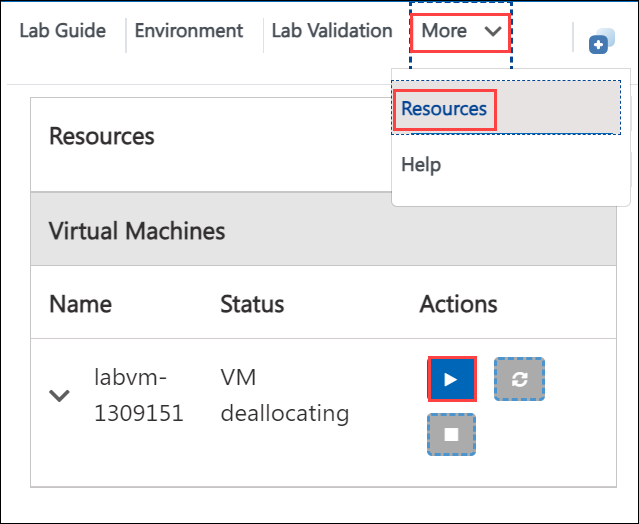

# Integrating Defender for DevOps with GitHub Advanced Security

### Overall Estimated Duration: 60 Minutes

## Overview

A Cloud Native Application Protection Platform (CNAPP) is a unified security solution tailored to protect cloud-native applications throughout their entire lifecycle. It integrates various security tools and processes to enhance visibility, ensure compliance, and provide robust threat protection across different environments, including infrastructure, application, and runtime. Key features encompass infrastructure security for identifying vulnerabilities, application security through comprehensive code scanning, runtime protection for real-time threat detection, and compliance management that automates adherence to regulations and industry standards.

For a retail company like Contoso, transitioning to a cloud-native architecture for its e-commerce platform involves leveraging a CNAPP to enhance security measures. The platform monitors cloud infrastructure for misconfigurations, scans code for vulnerabilities, and detects unusual behaviors during runtime to protect against attacks.

## Objective

The objective of the CNAPP lab is to equip participants with the skills to secure and manage cloud-native applications through hands-on experience in visibility, risk assessment, and threat detection.

- **Integrating Defender for DevOps with GitHub Advanced Security:** To strengthen application security by combining GitHub Advanced Security features with Defender for DevOps for comprehensive code scanning and threat protection.

## Prerequisites

Participants should have:

- **Basic Cloud Knowledge:** Familiarity with cloud computing concepts and Azure services.

- **Security Fundamentals:** A grasp of basic cybersecurity principles and practices.

- **DevOps Concepts:** Awareness of DevOps methodologies and practices, including CI/CD pipelines.

## Architechture

The architecture of the lab integrates various Azure services and components to create a secure, scalable environment for cloud-native applications. At the core, Azure Defender for Cloud monitors and manages the security posture of both Azure and hybrid environments, ensuring compliance and risk mitigation.Azure DevOps Services facilitate continuous integration and delivery (CI/CD) processes, while the Azure ADO Connector enhances security insights within these workflows. GitHub serves as the version control platform, integrating advanced security features to safeguard code. Additionally, Azure Virtual Machine Scale Sets ensure that applications can scale dynamically and maintain high availability, while Azure Active Directory manages user authentication and access across the entire architecture, creating a comprehensive security framework for cloud-native application development and deployment.

## Architechture Diagram

## Explanation of Components

The architecture for this lab involves the following key components:

- **Azure Defender for Cloud:** A unified security management system that helps protect Azure and hybrid environments, ensuring compliance and security posture management.

- **Docker:** A platform for developing, shipping, and running applications in containers, allowing for consistent environments across different stages of development.

- **Azure Virtual Machine Scale Sets:** A service that enables the deployment and management of a set of identical, load-balanced virtual machines, providing scalability and high availability for applications.

- **Azure DevOps Services:** A suite of development tools that support planning, collaboration, and CI/CD practices, enabling teams to build and deploy applications efficiently.

## Getting Started with Lab

1. Once the environment is provisioned, a virtual machine (JumpVM) and lab guide will get loaded in your browser. Use this virtual machine throughout the workshop to perform the lab. You can see the number on the lab guide bottom area to switch to different exercises of the lab guide.
   
   

1. To get the lab environment details, you can select the **Environment Details** tab. Additionally, the credentials will also be emailed to your email address provided during registration. You can also open the Lab Guide on a separate and full window by selecting the **Split Window** from the lower right corner. Also, you can start, stop, and restart virtual machines from the **Resources** tab.

   
 
1. Verify all the Virtual Machines are running. If not, please click on **Start** action button in the **Resources** tab.

   

## Login to Azure Portal

1. In the JumpVM, click on the Azure portal shortcut of the Microsoft Edge browser from the desktop.

   
   
1. On the **Sign in to Microsoft Azure** tab you will see a login screen, enter the following email/username and then click on **Next**. 
   * Email/Username: **<inject key="AzureAdUserEmail" enableCopy="true"/>** 
   
     
     
1. Now enter the following password and click on **Sign in**.
   * Password: **<inject key="AzureAdUserPassword" enableCopy="true"/>**
   
     
     
1. On **Action Required** pop-up, click on **Ask later**.

     

1. If you see the pop-up **Stay Signed in?**, click **No**.

1. If you see the pop-up **You have free Azure Advisor recommendations!**, close the window to continue the lab.

1. If a **Welcome to Microsoft Azure** popup window appears, click **Maybe Later** to skip the tour.

## Support Contact

The CloudLabs support team is available 24/7, 365 days a year, via email and live chat to ensure seamless assistance at any time. We offer dedicated support channels tailored specifically for both learners and instructors, ensuring that all your needs are promptly and efficiently addressed.

Learner Support Contacts:

- Email Support: cloudlabs-support@spektrasystems.com

- Live Chat Support: https://cloudlabs.ai/labs-support
   
Now, click on Next from the lower right corner to move to the next page.

### Happy Learning!!
