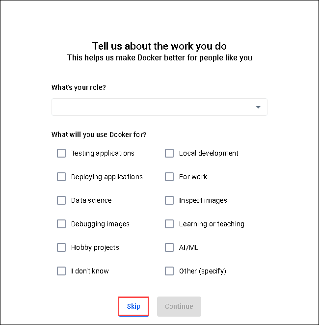
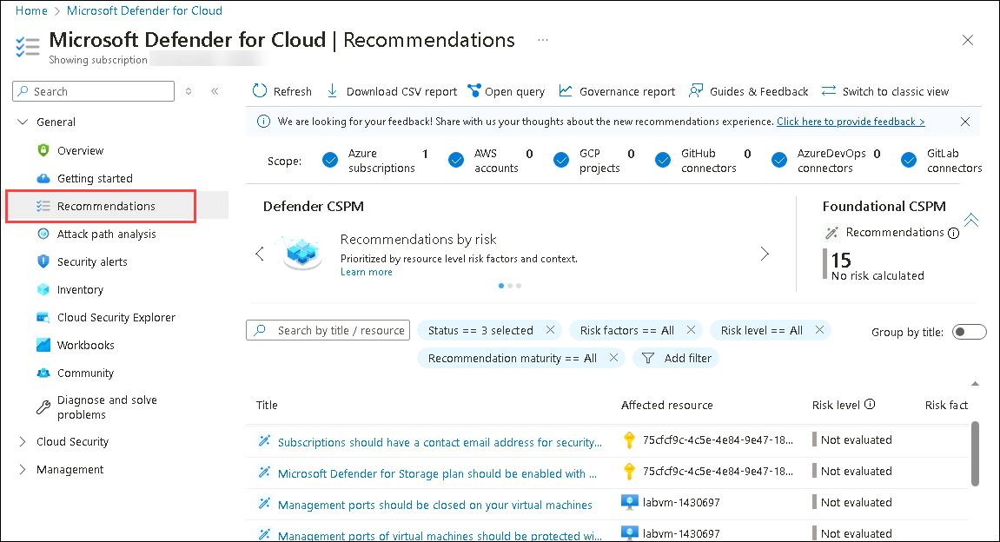
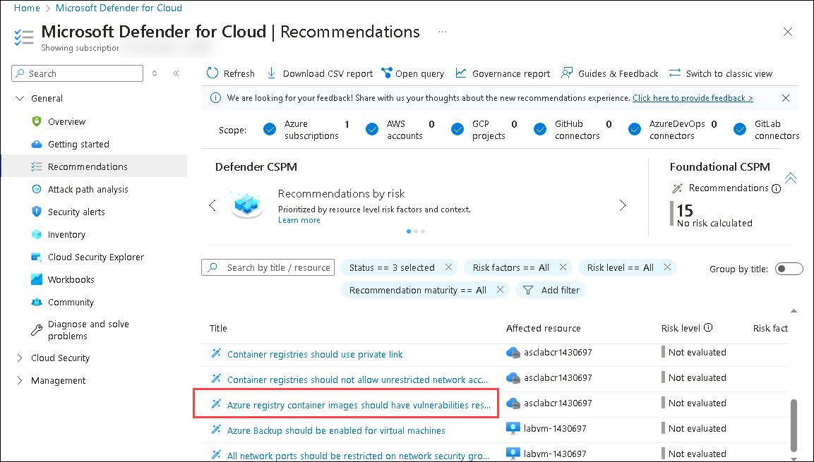
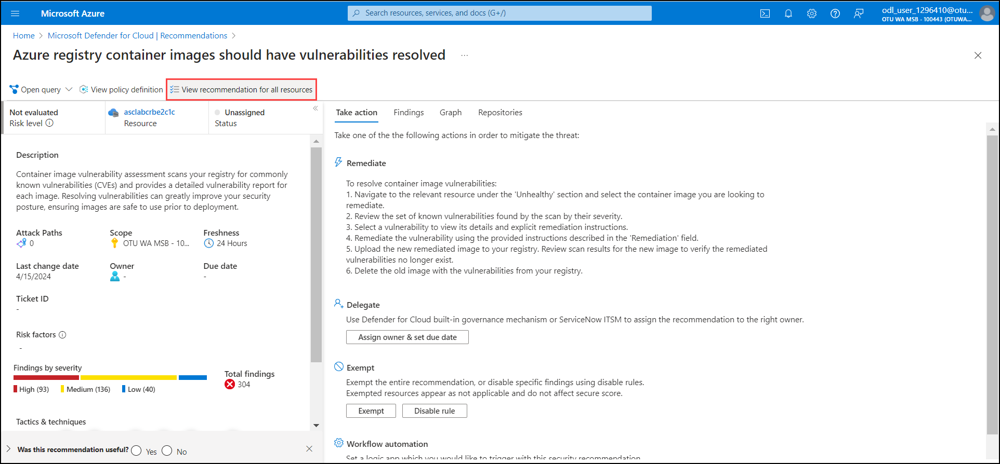
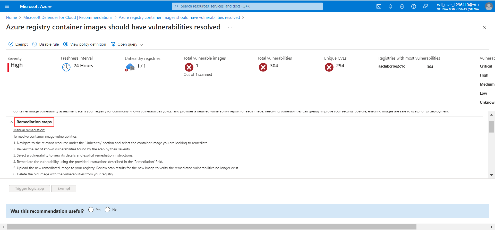
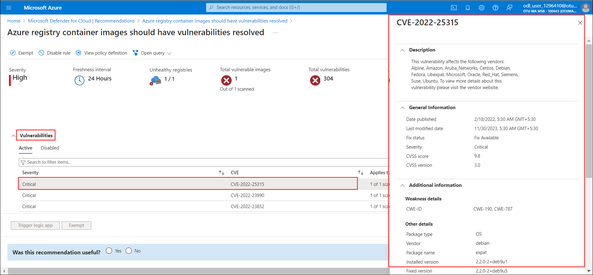

# Module 2: Defender for Containers

### Estimated Duration: 1 Hour

## Overview

This module focuses on container security by leveraging Microsoft Defender for Containers. It guides you through verifying Docker installation, managing vulnerable images, and using Defender for Cloud to assess and remediate vulnerabilities. These exercises will familiarize you with critical container security practices, ensuring your containerized applications are secure and compliant.

### Exercise 1: Verify Docker Installation

In this exercise, you will verify the installation of Docker to ensure it is properly set up and functioning on your system.

1. From the **Virtual Machine** desktop, click on **Start**, and click on **Docker Desktop**.
 
    

1. Click **Accept** on **Docker Subscription Service Agreement**.

    

1. Complete the installation of the Docker Desktop, click on **Finish**.

    

1. In Welcome to Docker Desktop, click on **Continue without signing in**.

    

1. In the **Tell us about the work you do**, Click on **Skip**.

    

1. Wait for the **Docker Engine** to start. 

    

    >**Note:** The startup process will take about five minutes. If it takes longer, restart the virtual machine.
    
1. Search for PowerShell in Search bar and select **Windows PowerShell**.

   

1. Verify your docker version by executing in PowerShell. 

   ```
   docker version
   ```

   You may see an output like the one below:

   

This exercise involves checking the Docker installation to confirm that it is correctly installed and operational on your system.

### Exercise 2: Download vulnerable image from Docker Hub into the Container Registry

In this exercise, Now you will use Docker to download a vulnerable image from it and push it into our existing Azure Container registry.

1. Navigate to the Azure Portal, search for **Container registries** **(1)** in the search box and select **Container registries** **(2)**.

   

2. Open the Container Registry named **asclabcrxxxxxx**.

   

3. In the Overview of it, verify the **Login server** name only. 

   

4. Switch back to PowerShell, you will also need to login to your Azure subscription via **az login**.
   
    ```
   az login
   ```    
     
5. Select **Work or school account** Enter the following **Email/Username** and **Password** in the browser and click on **Sign in**:

   - Email/Username: **<inject key="AzureAdUserEmail" enableCopy="true"/>** 

   - Password: **<inject key="AzureAdUserPassword" enableCopy="true"/>**
        
   >**Note:** If you are prompted to select a subscription, press enter and proceed with the next steps.
 
6. Make sure to update **NameOfServer** to **<inject key="Container registry" enableCopy="true"/>** and then run the below command.
   
   ```
   az acr login --name NameOfServer
   ```
 
   

7. Download vulnerable image from docker hub, by running the command below in PowerShell:

   ```
   docker pull vulnerables/web-dvwa
   ```

   

8. Check the image on your local repository by running the command below:

   ```
   docker images vulnerables/web-dvwa
   ```

   

9. Create an alias of the image by running the following command and make sure to replace **NameOfServer** to **<inject key="Container registry" enableCopy="true"/>** and then run the below command:

   ```
   docker tag vulnerables/web-dvwa <inject key="Container registry" enableCopy="true"/>.azurecr.io/vulnerables/web-dvwa
   ```

10. Check again the image on your local repository by running the command and make sure to replace **NameOfServer** to **<inject key="Container registry" enableCopy="true"/>** and then run the below command:

    ```
    docker images <inject key="Container registry" enableCopy="true"/>.azurecr.io/vulnerables/web-dvwa
    ```

    


11. Run docker push to upload the new image to the azure repository and generate image scan (it can take some time), using the below command and make sure to replace **NameOfServer** to **<inject key="Container registry" enableCopy="true"/>** and then run the below command:

    ```
    docker push <inject key="Container registry" enableCopy="true"/>.azurecr.io/vulnerables/web-dvwa
    ```

    

12. Then navigate back to the Azure portal and open the Container registry named **<inject key="Container registry" enableCopy="true"/>**.

13. Now select **Repositories** **(1)** under Services in the **<inject key="Container registry" enableCopy="false"/>** Container Registry resource. Notice the **vulnerable image** **(2)** is found in the ACR repository.

    


  <validation step="9049dcde-bf54-499f-b276-71704adbcf9b" />

  > **Congratulations** on completing the task! Now, it's time to validate it. Here are the steps:

  - Hit the Validate button for the corresponding task. If you receive a success message, you can proceed to the next task. 
  - If not, carefully read the error message and retry the step, following the instructions in the lab guide.
  - If you need any assistance, please contact us at labs-support@spektrasystems.com. We are available 24/7 to help you out.

This exercise involves downloading a vulnerable Docker image from Docker Hub and importing it into your Container Registry for further analysis.

### Exercise 3: Investigate the recommendation for vulnerabilities in ACR 

In th exercise, Once a vulnerable image has been pushed to the Azure Container Registry, then Microsoft Defender for Containers will start scanning the image for vulnerabilities, by using Qualys. You will now look into the recommendation in Microsoft Defender for Cloud for this. 
 
1. In the Azure Portal, search for Microsoft Defender **(1)** in the search box and then select **Microsoft Defender for Cloud** **(2)**.

     
   
2. From the **Microsoft Defender for Cloud** pane, select **Recommendations** from left-menu under General.

     
 
3. Now scroll down through the Title untill you find **Azure registry container registry images should have vulnerability findings resolved**, then click on it to get more details about it.
   
     

     >**Note:** It may take few minutes to update the recommendations.

1. Click on **view recommendation for all resources**.

     

4. Look around at what's available in the recommendation. Take a note of the Remediation Steps.

     
  
5. Select the **vulnerability** ***Azure registry container registry images should have vulnerability findings resolved***, under **vulnerabilites**, select one of the items in the list to get additional details about the patch available for it and how to remediate it.

     

This exercise involves examining and exploring recommendations to address vulnerabilities found in Azure Container Registry (ACR).

## Summary
This module guides you through essential container security practices, beginning with verifying your Docker installation. Next, you'll download a vulnerable Docker image from Docker Hub to your Container Registry, and conclude by exploring recommendations for addressing vulnerabilities found in Azure Container Registry (ACR).

