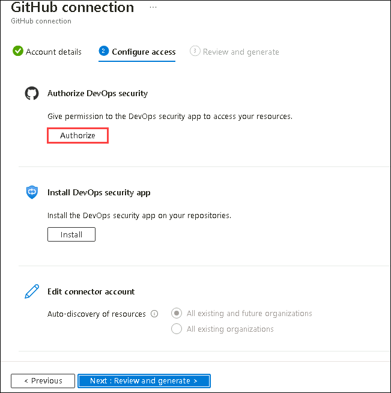
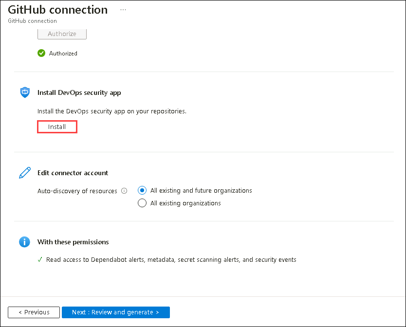
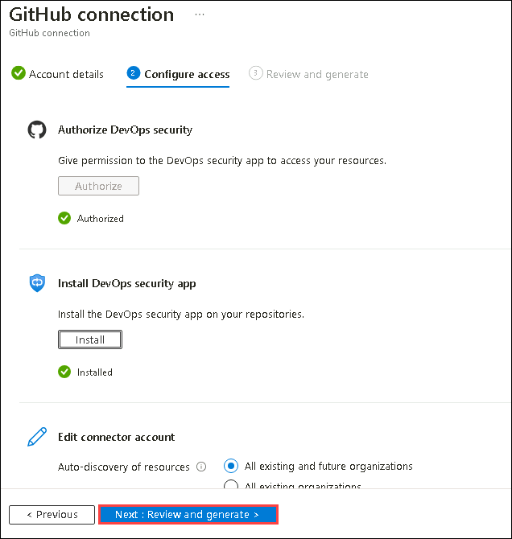
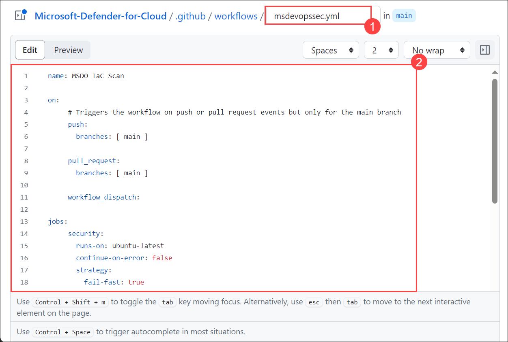
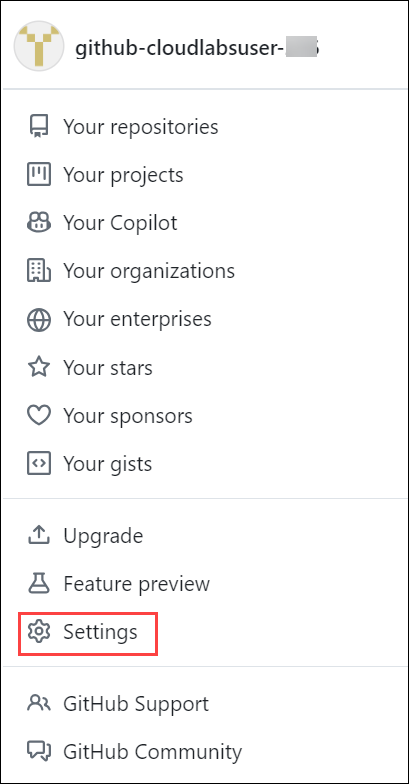

# Module 2:  Integrating Defender for DevOps with GitHub Advanced Security

## Objectives
In this Module, you will learn how to configure GitHub Connector in Defender for DevOps.

### Exercise 1: Connecting your GitHub organization

In this exercise, you will how to connect GitHub account with your Organization. 

1. Navigate and login to the GitHub using the following URL on the **Labvm**, by fetching the details from **Environment Details (1)** page on the right tab, click on **Licenses (2)** tab and copy the **GitHub credentials (3)**.

      ```
      https://github.com/
      ```

      

1. For Device Verification Code, use the same credentials as in the previous step, open http://outlook.office.com/ in a private window and enter the same username and password used for GitHub Account login. Copy the verification code and Paste code it in Device verification.

   

1. Navigate to following Git Repository **(1)** and click on **Fork (2)**.
   
      ```
      https://github.com/Azure/Microsoft-Defender-for-Cloud/tree/main
      ```
     
    

1. In **Create a new fork**, disable **Copy the main branch only (1)** and click **Create fork (1)**. 

         

1. Go to **Microsoft-Defender-for-cloud** repository,click on **Settings (1)**, under **Actions (2)** select **General (3)** and set the **Workflow Permissions** to **Read and write permissions (4)** then click **Save (5)**.

      

1.	Go to [Azure Portal](http://portal.azure.com/), search for **Microsoft Defender for Cloud (1)** and then click on it from the search results **(2)**. 

      

1.	In the left navigation pane, click **Environment settings (1)**, click the **Add environment (2)** button and click **GitHub (3)**. 

      

1. In **Create GitHub connection** page, enter the **Connector name** for the connector as `CNAPP-git` **(1)**, select your **Subscription (2)**, select **asclab (3)** **Resource Group** and select any **Location (4)**.	Click **Next: Configure access > (5)** button to continue.

      

1. Click **Authorize** button. If you get an authorization pop-up click **Authorize DevOps security**.

      

      

1. Now click **Install** button under **Install DevOps security app**. If this is the first time you’re authorizing your DevOps connection, you’ll receive a pop-up screen, that will ask you confirmation of which repository you'd like to install the app. Select your **GitHub repository**. 

      
  
      

1. Choose **All repositories (1)** and click on **Install (2)**

      

1. Back in the **Azure portal**, you’ll notice that the extension is installed, click on **Review and generate** button to continue.  

      

1. Click **Create**.

      

1. Navigating to the **Environment Settings** under **Microsoft Defender for Cloud**, you’ll notice the ***GitHub*** Connection was successfully created. 

      

This exercise imcludes connecting your GitHub account with your Organization.

### Exercise 2: Configure the Microsoft Security DevOps GitHub action

In this exercise, you will learn about configuring the Microsoft Security DevOps GitHub action to automate security checks within your GitHub workflows.

1. Navigate back to **GitHub**, from **Microsoft-Defender-for-Cloud** repository, click on **Actions (1)** and **I understand my workflows, go ahead and enable them (2)**.

      

1.	Click on **New workflow**.

      

1.	Next, for **Choose a workflow** click on **set up a workflow yourself**.  

      

1. Enter the name for your workflow file as **msdevopssec.yml (1)**. Then copy and paste the following sample action workflow into the **Edit new file (2)** tab. 

      ```
      name: MSDO IaC Scan
         
      on:
           # Triggers the workflow on push or pull request events but only for the main branch
           push:
             branches: [ main ]
         
           pull_request:
             branches: [ main ]
         
           workflow_dispatch:
         
      jobs:
           security:
             runs-on: ubuntu-latest
             continue-on-error: false
             strategy:
               fail-fast: true
         
             steps:
             - uses: actions/checkout@v3
         
             - uses: actions/setup-dotnet@v3
               with:
                 dotnet-version: |
                   5.0.x
                   6.0.x
         
             - name: Run Microsoft Security DevOps
               uses: microsoft/security-devops-action@preview
               continue-on-error: false
               id: msdo
               with:
                 categories: 'IaC'
         
             - name: Upload alerts to Security tab
               uses: github/codeql-action/upload-sarif@v2
               with:
                 sarif_file: ${{ steps.msdo.outputs.sarifFile }}
      ```
 
      

1.	Click on **Commit Changes** and click **Commit Changes** again. 

      

      

1. The process can take up to one minute to complete. A workflow gets created in your repositories GitHub folder with the above copied yml file. Select **Actions** and wait for it to complete running. 

      

1.	Once this job completes running, navigate to the **Security (1)** tab and click on **Code scanning (2)**. Code scanning findings will be filtered by specific MSDO tools in GitHub.

      

      <validation step="842515c8-c248-417b-b028-ef5d3abd0df4" />

> **Note**: To validate this Module you require **GitHub Username** and **Personal Access Token**.
>  
>   - You can create a **Personal access token**, by navigating to the user **Settings** under your profile and click on **Developer settings** option.
>     
>     
>     
>   - Now select **Personal Access Token (1)**, from the drop-down click on **Tokens (classic) (2)** then select **Generate new token (3)** and click on **Generate new token (classic) (4)**. 
>   
>       
>
>   - Enter any name for your PAT in the **Note**, then select the options provided in the screenshot below and click on **Generate Token**. Once the token is generated make sure to **Copy** it and paste it on any text editor such as a notepad. 
>  
>       


> **Congratulations** on completing the task! Now, it's time to validate it. Here are the steps:<br>
      - Navigate to the Lab Validation Page, from the upper right corner in the lab guide section.<br>
      - If not, carefully read the error message and retry the step, following the instructions in the lab guide.<br>
      - If you need any assistance, please contact us at labs-support@spektrasystems.com. We are available 24/7 to help!

This exercise includes configuring the Microsoft Security DevOps GitHub action to automate security checks in your workflows.

## Summary

In this module, you have learnt about how to connect your GitHub account to your organization's repositories, facilitating streamlined project management and collaboration. Next, you have configured the Microsoft Security DevOps GitHub action to automate security checks within your workflows, enhancing code security and compliance.

## Congratulations!! You have successfully completed the lab
